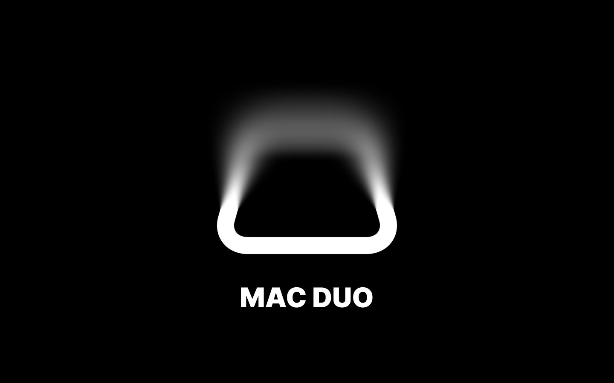
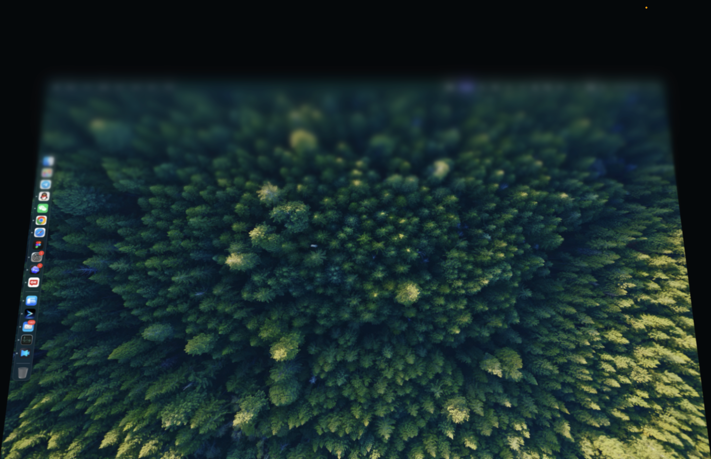

# Mac Duo

合上 MacBook 屏幕时，让桌面随开合角度逐渐变形、模糊。

**[下载 Mac Duo · Apple Silicon 测试版](https://github.com/xzchahaha-ctrl/mac-duo/releases/download/v0.1.0-beta.3/Mac-Duo-0.1.0-beta.3-arm64.zip)** · [版本说明](https://github.com/xzchahaha-ctrl/mac-duo/releases/tag/v0.1.0-beta.3)

## 使用条件

- Apple Silicon MacBook，并且能读取内置开合角度传感器。不是所有苹果芯片电脑都保证支持；台式 Mac 和 Intel Mac 不在支持范围内。
- 最低系统版本 macOS 15.7.7。
- 当前仅在 M4 Pro / macOS 15.7.7 上验证过。其他型号及更高系统版本尚未逐一验证。
- 真实桌面效果需要 macOS 的屏幕录制权限。不录制音频。

## 安装与使用

1. 下载上方 ZIP，解压，将 **Mac Duo.app** 拖入“应用程序”。
2. 打开 App。它驻留在菜单栏，默认尝试开启效果，没有独立主窗口。
3. 按系统提示允许 Mac Duo 录制屏幕；系统要求时退出并重新打开 App。
4. 左键点击菜单栏图标打开设置，右键显示操作菜单。

本测试版使用本地临时签名，**尚未取得 Apple Developer ID 签名和公证**。首次打开可能被 macOS 拦截；只有确认文件来源后，才按照 [Apple 的官方说明](https://support.apple.com/102445)处理。无需关闭系统安全保护，也无需安装驱动。

## 能做什么

- 从每次开始合盖的位置渐进增加桌面缩小、透视与顶部向下的模糊效果。
- 向下合盖触发效果；已有的效果随向上打开逐渐减弱。已经清晰时，向上打开不会重新触发模糊。停止开合 1.8 秒后平滑恢复清晰。
- 调整触发角度（60°–130°，初始 90°）时，拖动期间桌面保持清晰，松开鼠标后按最终值生效；滑感仍可实时调整。
- 在“效果预览”中拖动滑杆体验效果，不改变真实屏幕角度。
- 在菜单栏面板开启或关闭效果，或退出 App。
- QQ、微信联系方式支持只复制号码，点击号码显示对应二维码。

锁屏与休眠时暂停；解锁后在效果仍启用时恢复。真实效果仅作用于内建显示器。

## 测试版限制

这是体验性质的早期版本，不是安全保密工具。模糊不保证屏幕内容不可识别，不应代替系统锁屏。

开发测试中曾出现键盘输入异常，根因尚未确认；尚未完成跨机型、跨系统与长时间稳定性验证。遇到异常请停止使用，并在 [Issues](https://github.com/xzchahaha-ctrl/mac-duo/issues) 提供机型、系统版本与复现步骤，不要附带密码或私人屏幕内容。

## 隐私与广告

屏幕画面在本机内存中处理，不保存为录像，不上传桌面截图或开合角度。传感器只读访问；没有内核扩展、特权守护进程或开机自启动项。

预览区域支持远程广告图片。App 启动及运行期间会通过 HTTPS 从本仓库读取广告配置，刷新请求间隔至少 5 分钟；启用广告时还会请求指定的图片。网络服务提供方会收到普通访问请求（例如 IP 地址）。未添加广告或请求失败时显示默认桌面预览。

本仓库用于发布应用、使用说明及广告配置。源代码未在这里公开。
